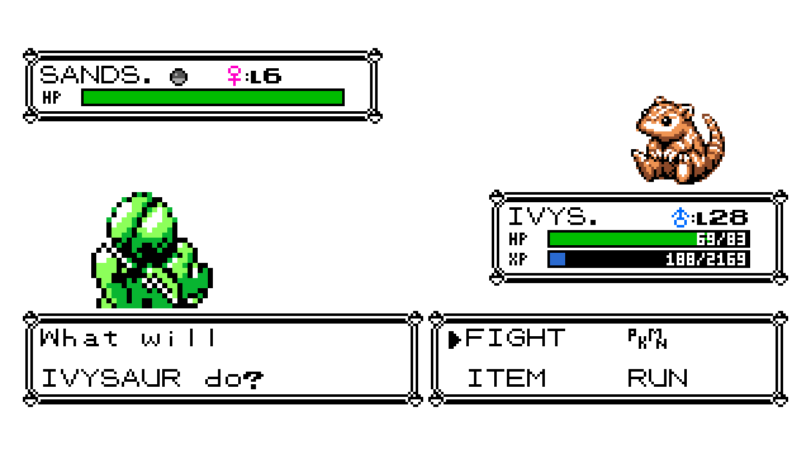
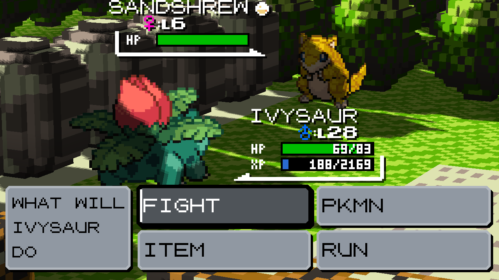

# Modern UI Suite


**0.1.28:** Fix overlapping Gen 2 item-PC pages and battle framing. Add shiny
collection history, clearer Pocket labels and sprite settings, plus optional
shop counts, area names and shorter low-HP alerts.

**[Browse all seven interfaces and setup examples](GALLERY.md)**

**Classic Pokémon, made clearer at a glance.**

Modern UI Suite refreshes the menus and information screens throughout the
game while keeping the character of the original handheld adventures. It uses
the familiar pixel type, Pokémon sprites, palettes, sounds, and controls, then
gives them more room to breathe on modern displays. The result feels less like
a replacement interface and more like the UI the games might have grown into.

The layouts respond to the space available instead of simply stretching the
Game Boy screen. They can stay compact at the original 160×144 aspect ratio,
spread out across a desktop window, or reorganize for a tall phone-shaped
view. The seven interface components keep native battle and progression rules.
A separate, optional Unlimited PP gameplay setting is OFF by default.

**[Download the latest installable release](https://github.com/piftee/gen1recomp-modern-ui-suite/releases/latest)**

## What it changes

- **A quicker START menu** — a compact, paged icon launcher keeps more of the
  overworld visible and puts important context within easy reach. Gen 2 games
  receive their proper PACK and POKéGEAR actions.
- **A more expressive party and summary view** — responsive, type-tinted cards
  make HP, experience, status, stats, and moves easier to scan without losing
  the original game's visual language.
- **A genuinely useful Bag and Item PC** — sensible pockets, item descriptions,
  money and capacity readouts, two visual skins, and layouts suited to both
  wide and narrow screens. Press Start to sort the Bag by pocket category or
  item name in either direction. Expanded storage supports 255 unique entries
  and stacks of up to 999 items. Gen 2's Modern skin now has the same All,
  Items, Medicine, Balls, TMs/HMs and Key views as Gen 1. They filter the four
  native stores without changing item ownership or native action rules;
  the Pocket skin keeps its four-pocket appearance and supports sorting too.
  The Modern skin places descriptions across the bottom so the tab rail and
  item list can use the full screen width.
  Both skins place exact money in the header. Fitting descriptions stay still;
  overflow pauses, scrolls left, holds briefly and jumps back to the start. It resets when the
  selected item, description or layout changes. Prompts and action overlays
  remain static.
- **Direct Pokémon storage management** — see the party and current Box
  together, inspect a Pokémon before moving it, and pick up, place, reorder,
  or swap Pokémon in one workspace. Gen 2 now opens this grid directly too,
  with all fourteen boxes and native held-item and Mail actions under START.
  Party rows wrap; optional Box Exclusive movement keeps navigation within the
  current box. START Multiple Selections moves ordered groups across boxes or
  swaps a whole party, with capacity, usable-party, Egg and Mail safeguards.
- **A Pokédex built for browsing** — caught and seen progress, filters, artwork,
  and dedicated information, stats, evolution-family, and move views make the
  Pokédex feel like a research tool rather than a long list.
  Native Gen 2 PC/Pokédex portraits use exact-image guarded background cutouts
  that preserve white markings and skip different replacement artwork.
- **More informative battles** — colored HP and EXP bars with compact white
  readouts inside them in Gen 1. Status, level, gender, and caught indicators
  add useful information while
  preserving the battlefield and the native battle flow. On Gen 2, active
  Battle Art and Stadium 2 battles retain their complete 3D scenes.
- **Type-aware move displays** — move cards and text use their type colors
  consistently in battle, summaries, move learning, move forgetting, Mimic,
  and PP selection, with clearer PP and effectiveness cues where relevant.
  Normal 16:9 Gen 2 battles use a full-width 2×2 move grid above a slim Power/PP
  strip. The held source move gets an amber border, distinct from destination
  focus. Dialogue alignment, full-opacity neutral box colors and responsive
  information placement are available on the Move Colors page.

Modern UI Suite supports Red, Blue, and Yellow, plus Gold, Silver, and Crystal
on Gen 2-capable Gen1Recomp builds. Every major feature has its own switch, so
you can use the complete visual refresh or keep only the parts that suit your
game. Detailed appearance and behavior options remain independent too.

## Install

Disable the seven standalone UI versions and standalone Unlimited PP before enabling this suite. The suite
declares hard conflicts so duplicate screen owners cannot silently overwrite
one another. Import the packaged ZIP in the Mods manager, enable **Modern UI
Suite**, then apply and restart.

Existing standalone presentation settings are copied into the suite the first
time it loads. Values already saved for the suite take precedence. The old
settings are left untouched.

## Direct touch

In **Options → Modern UI Suite → Start Menu / Party / Bag**, **DIRECT TOUCH**
defaults to On. It supports touch and primary mouse clicks on the rendered
START tiles, occupied Party cards, and Modern Bag rows and pocket tabs.

- Tap once to select; tap that selection again within two seconds to activate
  its normal A action. Even an initially selected item requires two taps.
- Tap a pocket once to switch. Swipe a list vertically to move its selection;
  swipe horizontally to change pockets or navigate START.
- Dragging cancels confirmation. Quantity, item-action, sorting and other
  modal dialogs keep their normal controller/on-screen button controls.
- B/back still uses the normal controls. PC, Pokédex and summary are outside
  this initial touch feature. The Gen 2 Pocket skin retains native controls;
  Gen 1's Pocket skin also supports selecting its list rows.

## Summary extensions and artwork

With **Kanto Reforged** enabled, Crystal/Gold/Silver retain its fourth summary
page; Red/Blue/Yellow append its INFO page after the normal pages (and DV page
when present). The provider supplies the actual gender, item and ability.
Missing values show dashes; long descriptions scroll while the ability name
stays visible. Unsupported extra pages retain their inherited renderer.

Wide stats pages move the number and types above the stats column, freeing
space for a larger portrait. Compact layouts retain their familiar arrangement.
For Gen 4 artwork, select **Menu Sprites → Battle Art** in the suite and choose
**Gen 4** front animations in the separate Battle Art provider. The suite
trims transparent animation margins without bundling additional sprites.

## Settings

Open **Options → Modern UI Suite**. The hub provides **Enable All UI**, **Disable
All UI**, and a page for each component. Left or Right on a component in the
hub toggles it directly; A opens its detailed settings.

**ASPECT RATIO** appears on the **Party**, **Bag**, **PC** and **Pokédex** pages,
and the **Battle** page in Gen 2:

- **FILL** (default) keeps the existing responsive layout for your display.
- **16:9** centers a widescreen layout with a filled surround.
- **4:3** centers a narrower layout suited to wide phone displays.

Party's setting also applies to Summary and its related pages. Native child
scenes keep their artwork centered and cover the surrounding menu; evolution
retains its original dialogue throughout the animation. Transparent prompts,
including Wilds of Kanto's Follow message, retain the parent's size.
The existing Party/Pokédex **WIDESCREEN OFF** setting and the game's **Faithful
Ratio** keep their native-size behavior. On Gen 1, a party picker opened from
the Bag inherits the Bag's surface to avoid a size jump during item use.

**SPRITE** selects the artwork used by the Pokédex, Pokémon stat screen and
large PC detail portrait. It never replaces the small icons. Use Left/Right
or A to cycle the saved portrait choice:

| Choice | Menu artwork |
| --- | --- |
| **BATTLE ART** (default) | Follows Battle Art's front generation and Static/Animated selection, including shiny variants. Supports the Gen 1 Voxel Fork and Gen 2 Battle Art. |
| **CRYSTAL** | Uses Crystal Animated Sprites with Shiny Visuals, including its normal/shiny art, animation mode and display colours. |
| **DEFAULT** | Keeps the suite's existing sprite handling and other mods' normal replacements. |

Provider mods must be installed and enabled separately. Missing or unsupported
artwork or Battle Art's ROM/MODDED mode uses the existing menu sprite.
A saved HGSS source from an earlier test build changes to Default. Eggs and
unseen Pokédex entries keep their placeholders.
Changes apply on the next draw. Large portraits animate. The setting chooses
a front portrait collection;
it does not put Battle Art's 3D models or player-facing back sprites into menus.
Gen 4 portraits trim transparent padding using the bounds of the complete
animation. The shared rectangle keeps framing stable as the Pokémon moves.

**Party → Icon Source** controls the small icons in Party and PC menus.
The hub’s **Sprite Info** explains portrait choices and provider fallbacks.
Small-icon choices are:

- **AUTO** (default): use the installed mods' icon handling.
- **ORIGINAL**: use the game's original small icons.
- **MENU PACK**: prefer a mod that supplies menu icons, such as Unique Menu Icons.
- **FOLLOWERS**: prefer the installed follower pack's icons when available.

An unavailable pack falls back to the existing icon handling. These are actual
icon sheets, never resized battle portraits. **Party → Icon Animation** applies
to explicit icon choices. Auto retains the installed renderer's normal animation.

Hooks such as battle overlays respond immediately. Screen replacements switch
the next time the affected screen is opened; an already-open menu is never
rebuilt underneath the player.

Disabling Modern Bag UI restores the native or compatible Bag presentation,
but the expanded 255-slot/x999 storage support remains active. This is a save
safety rule: lowering capacity while an expanded inventory exists could strand
items. Cartridge `.sav` export still has the original cartridge limits.

All seven UI components are enabled by default. **Disable All UI** preserves each
component's detailed preferences so they return unchanged when re-enabled.
Both bulk UI actions leave the independent **QOL** setting unchanged.

**QOL → UNLIMITED PP** is a single On/Off toggle, OFF on a fresh install.
When On, eligible player moves can be selected and used even at zero PP,
without consuming or permanently refilling their stored PP. Opponent PP
handling stays native, Disable and other native restrictions still apply, and link
battles retain native PP rules. Turning it Off immediately restores normal
rules using the real stored PP. It works with Party, Move Colors, Battle HUD,
or all seven UI components disabled. Battle PP readouts show **∞** when active;
ordinary out-of-battle summaries retain the actual stored values.

Gen 2 **Modern PC UI** also routes ordinary wild catches to the next box with
space when both the party and current box are full. It skips full boxes and
wraps from Box 14 to Box 1. The destination becomes the active box before the
throw and stays selected, including if the throw fails. A free party slot still
takes priority; completely full storage consumes neither a ball nor a turn.
This behavior follows the PC component's switch.

PC **BOX ONLY** defaults to Off. START → MULTIPLE SELECTIONS marks the focused
Pokémon; A marks others on that same side (including other boxes), and A on an
empty or opposite-side target places/swaps the group. Six box selections enable
START → SWAP WHOLE PARTY. B cancels, and SELECT browses boxes deliberately.

Move Colors **TEXT ALIGN** uses complete native lines for stable typing.
**BOX COLOR** only overrides neutral panels at opacity 100; Default retains
their original appearance. **INFO SIDE** keeps a bottom Power/PP strip at
normal Gen 2 16:9 sizes; explicit side panels need at least 360 logical pixels,
apart from the 161–223-pixel list fallback. Native 160-pixel command layouts,
Text Only and independently owned third-party panels remain unchanged. Gen 1
command/dialogue preferences apply to the Typed Move Colors Wide presenter.

Party **Select** picks up the highlighted slot; **Select** on another slot swaps
it. **B** cancels the hold. The footer shows pickup/drop hints. Battle replacement
and item-target menus retain their native selection rules. In small wide parties,
Up/Down can leave a column containing only one Pokémon. Gen 2 refusals
(such as a fainted choice) display their native message and **A/B CONTINUE**
instead of leaving the picker waiting behind an invisible message.

Start Menu **START ICON ORDER** opens the full live list after you open Start
once. Up/Down highlights an action; Left/Right moves it earlier/later. Native and
mod-added actions are included, and the saved order applies when Start reopens.

Bag **HIDE ALL ITEMS** removes the combined tab. **OPEN ON** chooses All, Items,
Medicine, Balls, TMs/HMs or Key; an unavailable choice falls back to Items.
In Gen 1, the Bag remembers the last pocket, item and scroll position during
play, including after using an item in battle. A depleted item leaves the
cursor on the nearest remaining row. **OPEN ON** controls the first opening
and changing it resets the remembered opening pocket.
**BAG POCKET ORDER** opens one editor: Select picks up a tab, Select swaps it
with another, and B cancels the hold. The editor follows the available tabs,
including Kanto Reforged and the four native pockets in Gen 2's Pocket skin.
Category sorting groups items in tab order, then orders items within each
category: Balls, healing items, status cures, boosters and other item families
follow a consistent sequence; TMs/HMs use their numbers. Descending reverses
the order. Sorting keeps the current pocket, selected item and quantities.
Unknown items use their names and IDs as a stable fallback.

## Collection and comfort options

The Pokédex records shiny species separately from ordinary caught flags. On
its index, **L/R** switches between **ALL** and **SHINY**; **SELECT** still opens
search. A sparkle mark and **SHINY** entry status identify collected species.
The record belongs to the save and survives release, trade and evolution.
Existing owned shiny Pokémon and Hall of Fame records supply backfill. Shinies
released before tracking began cannot be recovered without historical proof.
This collection filter does not change your portrait-provider preference.

Optional comfort settings, adapted from Waifu4Life's Highlander contribution:

- **Bag → Shop Counts**: show how many of the selected item are in your bag.
- **Start → Area Names**: show the area for two seconds on entering a map.
  Menus pause the banner; Crystal's native map signs take priority.
- **Battle → Low HP Beep**: **ON** keeps the native alert, **REDUCE** plays a
  short burst on entering red HP or switching Pokémon, and **OFF** silences it.

Shop Counts and Area Names start off. Low HP Beep starts on. These settings
follow their component's enabled switch and do not require Highlander.

## Gen 1 battle presentation

HP and EXP use small white numbers inside their bars, matching the party
menu's arrangement. EXP shows progress within the current level; long values
are shortened only when needed, and the level cap displays MAX. The wide
player panel includes space below EXP before its border.

**Battle Art (Gen 1):** the same bars and caught indicator are available in
its 3D presentation, including its native HUD fallback. Gender Mod's coloured
icons share the native level row and use the same position in every drawing
pass. Keep **Battle HUD → HUD ENABLED** On for these additions; Off restores
the provider's own HUD. Verified with Battle Art 1.10.1 and Gender Mod 0.3.6.





The separate white move-details window labelled like `NOR P35` belongs to
**Move Inspector**, which is listed under QOL. Disable that mod to remove its
window. The suite's move cards have their own Power/PP display.

## Compatibility API

**Battle Art 2.1.0 (Gen 2):** enable both mods and leave Battle Art's
**3D-BTL** option On. The suite retains Battle Art's arena, sprites, camera,
and attack rendering, with its coloured move cards over the scene. Turning
3D-BTL Off restores the suite's normal battle layout. Battle HUD and Move
Colors can each be switched independently, including during an open battle.
The Gen 2 port's `BATTLE_ART_VOXEL_GEN2` identity and screen-based scene API
are supported alongside the older `BATTLE_ART_VOXEL_FORK` contract.

The suite exports its component APIs beneath one mod identity:

```lua
local suite = mod.find("modern_ui_suite")
local dex = suite and suite.exports.components.modern_pokedex_ui
local dexExports = dex and dex.exports
```

Each component entry contains `version`, `enabled()`, and `exports`. The suite
also provides `suite.exports.isEnabled(legacyModId)`. Because the mod loader
does not support manifest aliases, `mod.find("modern_pokedex_ui")` does not
resolve to an embedded component; integrations should use the suite path above.

## Development

The component sources under `components/` are the authoritative suite copies.
Standalone releases are maintained separately and are not read at runtime or
during suite packaging.

```sh
luajit mods/modern_ui_suite/tests/modern_ui_suite_test.lua
luajit mods/modern_ui_suite/tests/battle_meters_test.lua
luajit mods/modern_ui_suite/tests/checklist_test.lua
luajit mods/modern_ui_suite/tests/gen2_catch_storage_test.lua
luajit mods/modern_ui_suite/tests/gen2_party_navigation_test.lua
python3 tools/modkit.py validate mods/modern_ui_suite --base auto
python3 tools/modkit.py lint mods/modern_ui_suite
python3 tools/modkit.py pack mods/modern_ui_suite \
  -o build/modern_ui_suite-0.1.28.zip
```

The live settings sweep opens every component page, drives the persisted
preferences through their advertised values, and captures each state:

```sh
SHOT_DIR=/tmp/modern-ui-suite-options \
POKEPORT_DRIVER=mods/modern_ui_suite/tests/options_preview_driver.lua \
POKEPORT_IDENTITY=modern-ui-suite-options POKEPORT_VERSION=red love .
```

On a Gen 2-capable engine checkout with a generated Gold, Silver, or Crystal
cache, the suite-specific proof driver captures the full native screen matrix:

```sh
SHOT_DIR=/tmp/modern-ui-suite-gen2 \
POKEPORT_DRIVER=mods/modern_ui_suite/tests/preview_driver.lua \
POKEPORT_IDENTITY=modern-ui-suite-gen2 love .
```

See `COMPONENTS.md` for the imported snapshot versions and
`THIRD_PARTY_NOTICES.md` for asset attribution.
